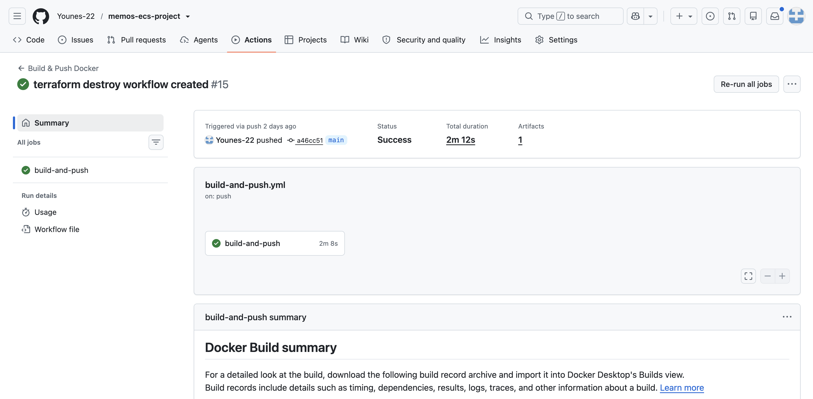
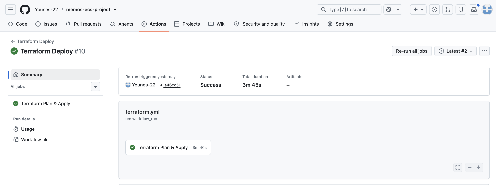
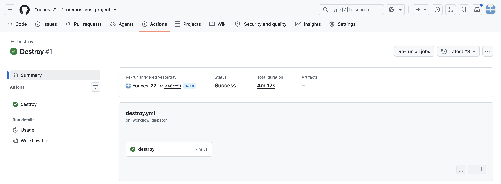
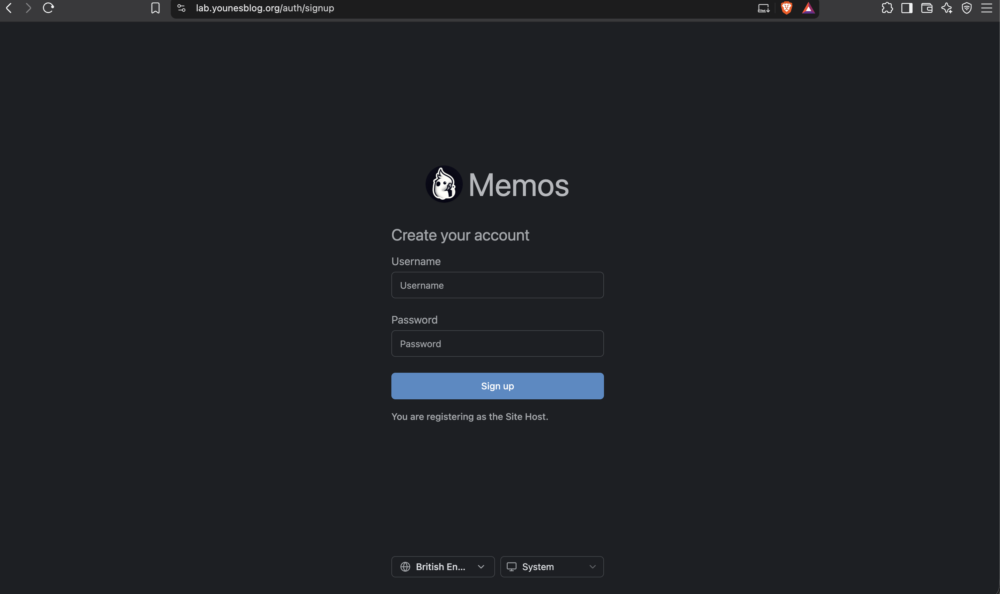
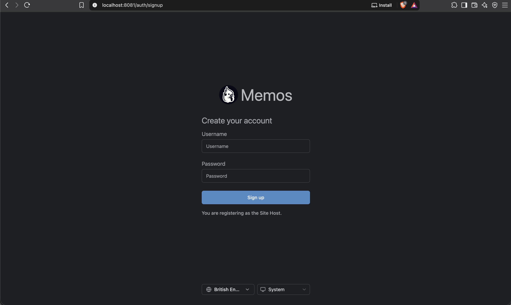

# Memos ECS Project

A DevOps project deploying the open-source [Memos](https://github.com/usememos/memos) application to AWS ECS Fargate.

The project demonstrates the progression from manual AWS configuration to Infrastructure as Code and automated CI/CD using Terraform, Docker, Amazon ECR and GitHub Actions.

## Table of Contents

* [What It Builds](#what-it-builds)
* [Live Application](#live-application)
* [What I Built](#what-i-built)

  * [AWS Infrastructure](#aws-infrastructure)
  * [Container Platform](#container-platform)
  * [Load Balancing and HTTPS](#load-balancing-and-https)
  * [Docker and ECR](#docker-and-ecr)
  * [GitHub Actions and OIDC](#github-actions-and-oidc)
* [Repository Structure](#repository-structure)
* [Tech Stack](#tech-stack)
* [Local Setup](#local-setup)
* [Deployment Flow](#deployment-flow)
* [Validation and Security](#validation-and-security)
* [Pipeline Evidence](#pipeline-evidence)
* [Current Scope and Limitations](#current-scope-and-limitations)
* [Future Improvements](#future-improvements)
* [Why This Project](#why-this-project)

---

## What It Builds

The application is deployed to AWS using the following architecture:


This diagram was made with draw.io
---

## Live Application

**Memos:** `lab.younesblog.org`

The application is served over HTTPS through an Application Load Balancer.

A deployment health check also verifies:

```text
GET /health
```

Expected response:

```json
{"status":"ok"}
```

---

# What I Built

## AWS Infrastructure

The AWS infrastructure is managed with Terraform and deployed in `eu-west-2`.

The infrastructure includes:

* VPC using `10.0.0.0/16`
* Two public subnets across separate Availability Zones
* Two private subnets across separate Availability Zones
* Internet Gateway
* One NAT Gateway per Availability Zone
* Route tables and subnet associations
* ECS Fargate cluster and service
* Application Load Balancer
* Target group and listeners
* Security groups
* IAM roles
* ACM certificate
* Route 53 DNS records
* Amazon ECR repository
* S3 remote Terraform state

Terraform is organised into reusable modules for the main infrastructure components.

## Container Platform

Memos runs as a container on Amazon ECS Fargate.

The ECS tasks:

* Run in private subnets
* Do not receive public IP addresses
* Listen on port `8081`
* Are accessed through the Application Load Balancer
* Pull their container image from Amazon ECR

The ECS task definition receives the exact Docker image tag generated by the CI pipeline.

## Load Balancing and HTTPS

An internet-facing Application Load Balancer provides the public entry point to the application.

Traffic flows through:

```text
Internet
   ↓
Cloudflare
   ↓
Route 53
   ↓
Application Load Balancer
   ↓
ECS Fargate
```

TLS is handled by AWS Certificate Manager using a certificate for `lab.younesblog.org`.

The ALB target group performs health checks against:

```text
/health
```

This ensures the load balancer only sends traffic to healthy ECS tasks.

## Docker and ECR

I created a custom multi-stage Dockerfile rather than relying on a pre-built Memos image.

The Docker build consists of:

1. **Frontend stage** — builds the Memos frontend using Node.js and pnpm.
2. **Go build stage** — compiles the Memos backend.
3. **Runtime stage** — runs the compiled application using Alpine Linux.

The final container runs as a non-root `memos` user.

The production image is built for:

```text
linux/amd64
```

to match the ECS Fargate task architecture:

```text
X86_64
```

Images are tagged using the Git commit SHA rather than `latest`.

For example:

```text
<commit-sha>
```

This gives each image a unique and traceable version and allows the deployment to reference the exact image produced by the build.

## GitHub Actions and OIDC

GitHub Actions handles the build and deployment process using AWS IAM roles with GitHub OIDC.

No long-lived AWS access keys are stored in GitHub.

Two separate IAM roles are used:

```text
GitHub Actions
      │
      ├── ECR Role
      │      └── Build and push container image
      │
      └── Terraform Role
             └── Manage infrastructure
```

The GitHub OIDC trust policy is restricted to this repository and the `main` branch.

Terraform's CI/CD role is also separate from the bootstrap resources so that destroying the application infrastructure does not remove the credentials required to deploy it again.

---

# Repository Structure

```text
.
├── .github/
│   └── workflows/
│       ├── build-and-push.yml
│       ├── terraform.yml
│       └── destroy.yml
│
├── app/
│   ├── Dockerfile
│   └── .dockerignore
│
├── docs/
│   ├── architecture.png
│   ├── build-and-push.png
│   ├── terraform.png
│   └── destroy.png
│
├── terraform/
│   ├── bootstrap/
│   │   └── ...
│   │
│   ├── modules/
│   │   ├── acm/
│   │   ├── alb/
│   │   ├── dns/
│   │   ├── ecs/
│   │   ├── iam/
│   │   ├── route53/
│   │   └── vpc/
│   │
│   ├── backend.tf
│   ├── main.tf
│   ├── variables.tf
│   ├── outputs.tf
│   ├── providers.tf
│   ├── data.tf
│   └── versions.tf
│
├── .gitignore
└── README.md
```


The Terraform configuration is separated into:

* **Bootstrap** — long-lived CI/CD resources such as GitHub OIDC and IAM roles.
* **Application infrastructure** — networking, ECS, ALB, ACM and DNS resources.

This prevents destroying the application environment from also destroying the infrastructure required to deploy it.

---

# Tech Stack

| Category               | Technology                |
| ---------------------- | ------------------------- |
| Application            | Memos                     |
| Cloud                  | AWS                       |
| Container Platform     | ECS Fargate               |
| Container Registry     | Amazon ECR                |
| Infrastructure as Code | Terraform                 |
| Containerisation       | Docker                    |
| CI/CD                  | GitHub Actions            |
| Authentication         | GitHub OIDC + AWS IAM     |
| Load Balancing         | Application Load Balancer |
| TLS                    | AWS Certificate Manager   |
| DNS                    | Route 53 + Cloudflare     |
| State Management       | Amazon S3                 |
| Application            | Go + Node.js/pnpm         |

---

# Local Setup

## Prerequisites

- AWS CLI
- Terraform
- Docker
- Git
- AWS account
- GitHub repository with Actions enabled
- An existing Amazon ECR repository named `my-memos-app`

> The `my-memos-app` ECR repository must be created before running the GitHub Actions workflow. The workflow pushes the built Docker image to this repository; it does not create the repository automatically.

## Clone the Repository

```bash
git clone <repository-url>
cd memos-ecs-project
```

## Run Memos Locally

```bash
cd app

docker build -t memos-local .

docker run -d \
  --name memos-local \
  -p 8081:8081 \
  memos-local
```

Check the application:

```bash
curl -i http://localhost:8081/health
```

On Apple Silicon, the production architecture can be tested with:

```bash
docker build --platform linux/amd64 -t memos-local .
```

## Validate Terraform

Terraform can be validated locally without connecting to the remote backend:

```bash
terraform init -backend=false
terraform fmt -check
terraform validate
```

---

# Deployment Flow

The deployment is split into a long-lived bootstrap layer and the application infrastructure.

## 1. Bootstrap CI/CD Infrastructure

The bootstrap Terraform configuration creates:

* GitHub OIDC provider
* ECR IAM role
* Terraform IAM role
* Required IAM policies

These resources are kept separate from the application infrastructure.

## 2. Prepare Route 53

The `lab.younesblog.org` hosted zone is created and delegated from Cloudflare.

The hosted zone itself is intentionally kept outside the main application Terraform so that destroying and recreating the application does not require changing DNS delegation.

Terraform instead looks up the existing hosted zone and manages the application records inside it.

## 3. Prepare ECR

The ECR repository is created separately and retained between deployments.

This allows application infrastructure to be destroyed and recreated without losing previously pushed container images.

## 4. Build and Push

A push to `main` triggers:

```text
GitHub
   ↓
GitHub Actions
   ↓
Authenticate with AWS using OIDC
   ↓
Build Docker image
   ↓
Tag image with Git SHA
   ↓
Push image to ECR
```

## 5. Deploy ECS

The Terraform workflow runs after the image build.

It:

1. Checks out the same commit.
2. Generates the ECR image URI using the Git SHA.
3. Runs Terraform formatting and validation.
4. Creates a Terraform plan.
5. Applies the infrastructure.
6. Updates the ECS task definition with the new image.
7. Waits for the deployment.
8. Performs an external health check.

The important part is that the same Git SHA is used for both the image and ECS deployment.

```text
Git commit
    │
    ├── Docker build
    │       └── ECR:<SHA>
    │
    └── Terraform
            └── ECS → ECR:<SHA>
```

## 6. Validate

After deployment, the workflow checks:

```text
HTTPS endpoint
      ↓
ALB
      ↓
Target Group
      ↓
ECS
      ↓
/health
```

The deployment is considered successful when the health endpoint returns HTTP `200`.

## 7. Destroy

The `destroy.yml` workflow can be manually triggered to remove the application infrastructure.

It removes resources such as:

* VPC
* Subnets
* Route tables
* Internet Gateway
* NAT Gateways
* ECS cluster/service
* Application Load Balancer
* Target group
* ACM certificate
* Application Route 53 record

Long-lived bootstrap resources are retained, including:

* GitHub OIDC provider
* IAM roles
* S3 Terraform state
* ECR repository
* Route 53 hosted zone

---

# Validation and Security

The project was validated at multiple levels.

### Docker

* Local production image builds successfully
* Container runs locally
* `/health` returns HTTP `200`

### Terraform

* `terraform fmt`
* `terraform validate`
* `terraform plan`
* `terraform apply`
* Successful `terraform destroy`

### ECS

* ECS task reaches `RUNNING`
* ECS task runs without a public IP
* ALB target becomes healthy
* Application is reachable through HTTPS

### CI/CD

* GitHub Actions successfully authenticates using OIDC
* Docker image is pushed to ECR
* Terraform deployment completes
* Post-deployment health check succeeds

### Security

* No long-lived AWS credentials stored in GitHub
* GitHub OIDC used for AWS authentication
* ECS tasks run in private subnets
* ALB security group allows public HTTP/HTTPS traffic
* ECS security group only accepts application traffic from the ALB
* Container runs as a non-root user
* Images use immutable Git SHA tags

---

# Pipeline Evidence

## Docker Build and Push

The workflow builds the production image and pushes it to ECR using the Git commit SHA.



## Terraform Deployment

The Terraform workflow validates, plans and applies the infrastructure before performing the deployment health check.



## Infrastructure Teardown

The destroy workflow provides a manual way to remove the application infrastructure while retaining the long-lived bootstrap resources.



---

## Live AWS Deployment

<video src="./docs/recording.mp4" controls></video>

# Memos Application 




## Local Docker Deployment



---

# AWS Runtime Checks

The deployed environment can be verified through the AWS console by checking:

### ECS

* Cluster is running
* Service is active
* Task is `RUNNING`
* Task is deployed in a private subnet

### Load Balancer

* ALB is internet-facing
* Target group contains the ECS task
* Target health is `healthy`
* HTTPS listener is active

### Networking

* Two Availability Zones are used
* Public subnets contain the NAT Gateways
* Private subnets route outbound traffic through their respective NAT Gateway
* ECS tasks do not have public IP addresses

### ECR

* Image exists in the repository
* Image tag corresponds to the deployed Git commit

---

# Current Scope and Limitations

The project focuses on demonstrating containerisation, AWS infrastructure, Infrastructure as Code and CI/CD rather than building a production-ready application platform.

Current limitations include:

* ECS service runs a single task
* Application data is not backed by a separately managed database or persistent storage layer
* ECR repository is created separately from the main application Terraform
* Route 53 hosted zone is created and delegated separately
* The environment currently uses one ECS service rather than multiple independently scaled services

The infrastructure itself spans two Availability Zones, with public/private subnets and a NAT Gateway in each AZ. The application layer could be made more resilient by running multiple ECS tasks across the AZs.

---

# Future Improvements

Potential improvements include:

* Run multiple ECS tasks across both Availability Zones
* Add ECS Service Auto Scaling
* Introduce RDS or another managed persistent storage solution
* Add automated database backups and recovery
* Add HTTP → HTTPS redirection
* Add CloudWatch logging and monitoring
* Add CloudWatch alarms
* Move ECR creation into the bootstrap Terraform configuration
* Further restrict IAM permissions following least-privilege principles

---

# Why This Project

The main goal was to build a realistic DevOps deployment rather than simply deploy an application to AWS.

The project demonstrates the progression:

```text
Manual AWS Configuration
        ↓
Docker Containerisation
        ↓
Terraform Infrastructure as Code
        ↓
AWS ECS Fargate
        ↓
GitHub OIDC
        ↓
Automated CI/CD
        ↓
Automated Validation
```

This provided practical experience with the infrastructure, security and deployment workflow involved in running a containerised application on AWS.
